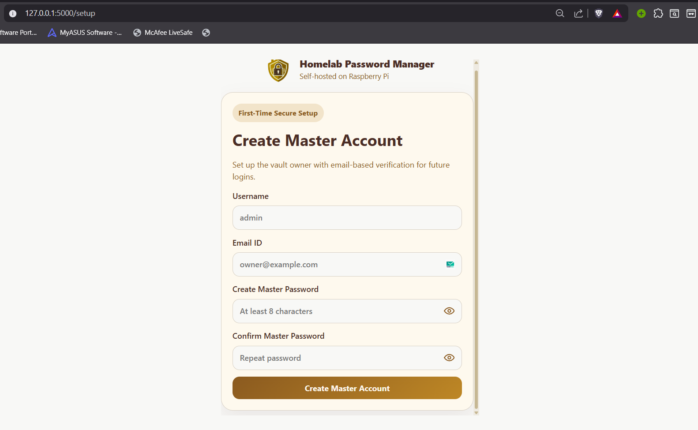
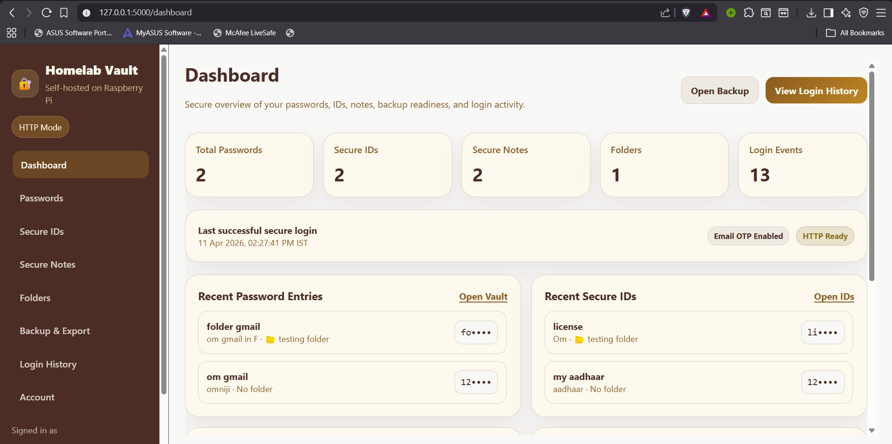
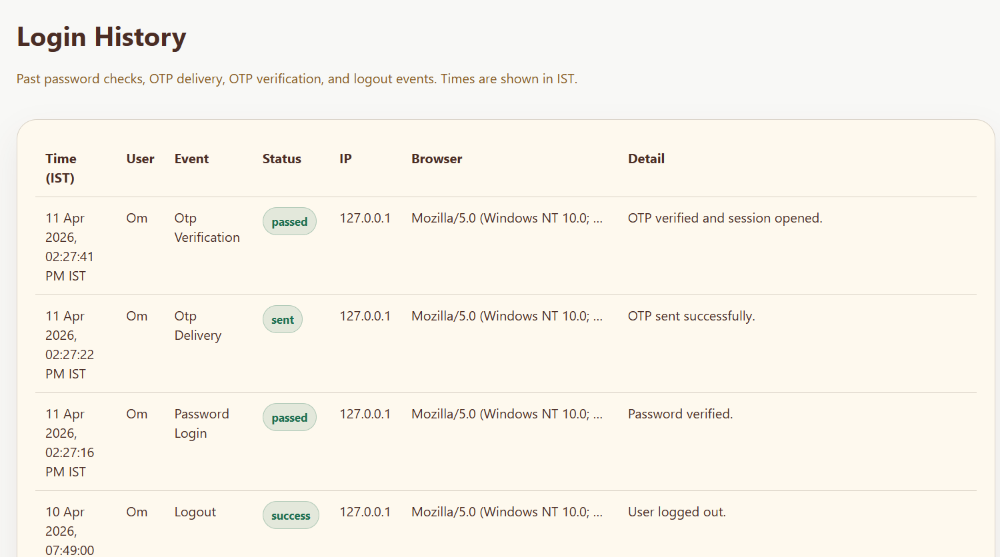

# Homelab Vault Secure Manager

Self-hosted password and secrets manager for Raspberry Pi, Docker, or any machine that can run Flask and SQLite. This repo is structured for **GitHub** and **production-style deployment**: configuration comes from environment variables and `.env` .

## Description

Homelab Vault is a single-user style vault: one master account, password login, **email OTP on every sign-in**, encrypted fields at rest (Fernet), and optional **HTTPS** behind Caddy. Data lives in a local SQLite file under `instance/`.

## Features

- **Master account** — username, email, master password, confirmation on first run (`Create Master Account`)
- **Login** — password step, then **fresh OTP** each session (email when SMTP is configured, or dev mode)
- **Password vault** — add, edit, delete, search, show/hide, copy
- **Secure IDs** — encrypted secret values
- **Secure notes** — encrypted note bodies
- **Backup / export** — encrypted JSON export of folders, passwords, IDs, and notes
- **Login history** — audit-style events with timestamps in **IST**
- **Account** — optional destructive deletion with OTP confirmation
- **Schema migrations** — in-place SQLite upgrades for older `vault.db` files

## Screenshots

<p align="center">
  <br />
  <em>First-time setup — Create Master Account</em>
</p>
<p align="center">
  <br />
  <em>Dashboard — passwords, IDs, notes, and status</em>
</p>
<p align="center">
  <br />
  <em>Login history — password checks, OTP, and logouts (IST)</em>
</p>

## Tech stack

- Python **Flask**
- **SQLite** + **SQLAlchemy** / Flask-SQLAlchemy
- **cryptography** (Fernet) for field encryption
- HTML / CSS / JavaScript
- **Docker** / Docker Compose
- **Caddy** (optional HTTPS reverse proxy)

## Prerequisites

- Python 3.11+ recommended (project tested with 3.14 in dev)
- `pip` and a virtual environment

## Local setup

1. Clone the repository and enter the project directory.

2. Create a virtual environment and install dependencies:

   **Windows (PowerShell)**

   ```powershell
   python -m venv .venv
   .\.venv\Scripts\Activate.ps1
   pip install -r requirements.txt
   ```

   **macOS / Linux**

   ```bash
   python -m venv .venv
   source .venv/bin/activate
   pip install -r requirements.txt
   ```

3. Copy environment template and edit placeholders (see `.env.example`):

   ```bash
   cp .env.example .env
   ```

   Use `OTP_DEV_MODE=true` for local runs without SMTP. For real email OTP, set `OTP_DEV_MODE=false` and fill in all SMTP variables with real values (never commit them).

4. Run the app:

   ```bash
   python run.py
   ```

5. Open [http://127.0.0.1:5000](http://127.0.0.1:5000). With an empty database you should see **Create Master Account** on `/setup`.

### Reset local SQLite data

To wipe `instance/vault.db` (and optional `-wal`/`-shm`) and return to first-run setup, stop the server, delete those files, or use:

```bash
python scripts/reset_local_dev.py --yes --no-backup
```

(`--no-backup` skips copying files under `backups/`, which is appropriate for a clean repo checkout.)

## SMTP / OTP configuration

Set these when using real email OTP (also documented in `.env.example`):

```bash
export SMTP_SERVER=smtp.gmail.com
export SMTP_PORT=587
export SMTP_USERNAME=your-email@gmail.com
export SMTP_PASSWORD=your-app-password
export SMTP_FROM_EMAIL=your-email@gmail.com
export SMTP_USE_TLS=true
```

For local testing without mail, set `OTP_DEV_MODE=true` in `.env`.

## Deployment notes

- **Secrets:** Set `SECRET_KEY` (and optionally `FERNET_KEY`) via environment or `.env` on the server. Treat any previously leaked key or SMTP password as compromised and **rotate** them before going live.
- **Docker:** Build and run as in the commands below; mount `instance/` so the database survives container restarts.
- **HTTPS:** Behind Caddy or another reverse proxy, set `SESSION_COOKIE_SECURE=true`, `FORCE_HTTPS=true`, and `ENABLE_PROXY_FIX=true` as in the HTTPS section below.

## Run with Docker

```bash
docker build -t homelab-vault .
docker run -d -p 5000:5000 -e SECRET_KEY='replace-this-secret' -e SMTP_SERVER='smtp.gmail.com' -e SMTP_PORT='587' -e SMTP_USERNAME='your-email@gmail.com' -e SMTP_PASSWORD='your-app-password' -e SMTP_FROM_EMAIL='your-email@gmail.com' -v "$(pwd)/instance:/app/instance" homelab-vault
```

## Run with Docker Compose

```bash
docker compose up -d --build
```

## HTTPS on Raspberry Pi with Caddy

This project includes `deploy/caddy/Caddyfile` and `docker-compose.https.yml` so you can add HTTPS without rebuilding the whole Pi image.

### Public domain

1. Point your domain to the Raspberry Pi.
2. Set `DOMAIN_NAME` and optionally `ACME_EMAIL`.
3. Start the HTTPS stack:

```bash
DOMAIN_NAME=your-domain.example ACME_EMAIL=you@example.com docker compose -f docker-compose.yml -f docker-compose.https.yml up -d --build
```

### LAN-only demo

Edit `deploy/caddy/Caddyfile` and use `tls internal` for locally trusted certificates if needed.

### Env switches behind TLS

```bash
SESSION_COOKIE_SECURE=true
FORCE_HTTPS=true
ENABLE_PROXY_FIX=true
```

## First login flow

1. Open the app → **Create Master Account** (empty database).
2. Sign in with username or email + password.
3. Complete OTP (email or dev mode).
4. Use Dashboard, Passwords, Secure IDs, Secure Notes, Folders, Backup & Export, and Login History.

## Existing database upgrade

If you already have an older `vault.db`, this version upgrades the schema in place (OTP/email columns, secure notes, login history).

## Testing

```bash
pytest
```

Live-server smoke test:

```bash
python tests/e2e_live_server.py
```

Playwright (optional):

```bash
python tests/e2e_playwright.py
```

If browsers are missing: `python -m playwright install chromium`.

## Project structure

```text
homelab-vault/
├── app/
│   ├── static/
│   │   ├── css/
│   │   ├── images/    # favicon, logo, README screenshots (Creation, Dashboard, LoginHistory)
│   │   └── js/
│   ├── templates/
│   ├── __init__.py
│   ├── audit.py
│   ├── auth.py
│   ├── extensions.py
│   ├── mailer.py
│   ├── migrations.py
│   ├── models.py
│   ├── security.py
│   └── vault.py
├── deploy/
│   └── caddy/
│       └── Caddyfile
├── scripts/
│   └── reset_local_dev.py
├── tests/
├── instance/          # runtime SQLite (gitignored except .gitkeep)
├── docker-compose.yml
├── docker-compose.https.yml
├── .env.example
├── Dockerfile
├── README.md
├── requirements.txt
└── run.py
```
